# Open Chords Charts Grammar

This file lists all the different cases which can happen in a Chords Charts.

Each case is described by an image extracted from an existing Chords Charts, and a text representation.

| Description                                 | Image                                         | Plain text     | Occurs in sample                                         |
| ------------------------------------------- | --------------------------------------------- | -------------- | -------------------------------------------------------- |
| Major chord                                 |          | `C`            | [All of me](./samples/All%20of%20me.png)                     |
| Minor chord                                 | 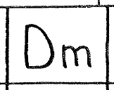         | `Dm`           | [All of me](./samples/All%20of%20me.png)                     |
| 6th chord                                   |            | `A6`           |                                                          |
| 7th chord                                   | 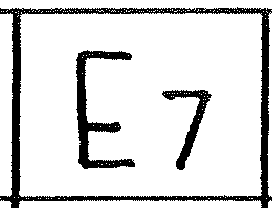           | `E7`           |                                                          |
| 7th minor chord                             | 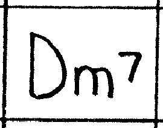     | `D7m`          |                                                          |
| Diminished chord                            |            | `Bdim`         |                                                          |
| Semi-diminished chord                       | 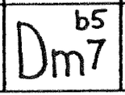       | `Dm7b5`        |                                                          |
| 9th chord                                   | 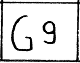           | `G9`           |                                                          |
| Bar with 2 chords                           | 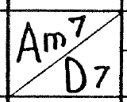        | `Am7/D7`       |                                                          |
| Bar with 2 chords 3 beats then 1         | 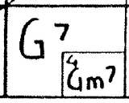    | `G7/-/-/Gm7`   | [Am I blue](./samples/Am%20I%20blue.png)                     |
| Bar with 3 chords                           | 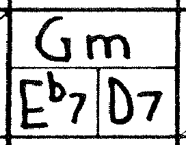        | `Gm7/-/Eb7/D7` |                                                          |
| Bar with 4 chords                           |         | `Ab/C7/Fm/Eb6` | [And the angels sing](./samples/And%20the%20angels%20sing.png) |
| Bar repeat following a bar with 1 chord  | 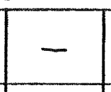  | `-`            | [All of me](./samples/All%20of%20me.png)                     |
| Bar repeat following a bar with 2 chords | 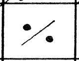 | `%`            | [And the angels sing](./samples/And%20the%20angels%20sing.png) |
| Bar repeat following 2 bars              | 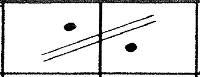   |                |                                                          |
| Bar with chord descend                      | 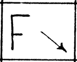         | `F↘`           | [Always](./samples/Always.png)                           |
| Break of 1 bar                              | 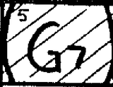         | `[G7]`         | [Cocktails for two](./samples/Cocktails%20for%20two.png)     |
