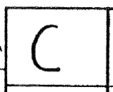
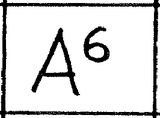
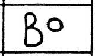
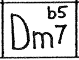
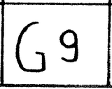

# Open Chords Charts Grammar

This file lists all the different cases which can happen in a Chords Chart.

Each case is described by an image extracted from an existing Chords Charts, and a text representation.

## Chords

Inspired from:
- [Chord](https://en.wikipedia.org/wiki/Chord_(music)) Wikipedia page.
- [Chord names and symbols](https://en.wikipedia.org/wiki/Chord_names_and_symbols_(popular_music)) Wikipedia page.
- [Anthologie des Grilles de Jazz](https://www.amazon.fr/Anthologie-Grilles-Jazz-morceaux-Coltrane/dp/B00P2VZS0Y) (by [Philippe Baudoin](http://www.baudoinjazz.com/))
- [Chord Name Finder](http://www.sengpielaudio.com/ChordNameFinder.htm)

| Name                | Image                                                | Plain text | Occurs in sample                         |
| ------------------- | ---------------------------------------------------- | ---------- | ---------------------------------------- |
| Major triad         |          | `C`        | [All of me](./samples/All%20of%20me.png) |
| Minor triad         |          | `Dm`       | [All of me](./samples/All%20of%20me.png) |
| Augmented triad     |                                                      | `C+`       |                                          |
| Major 6th           |                  | `A6`       |                                          |
| Minor 6th           |                                                      | `Am6`      |                                          |
| 7th                 |                  | `E7`       |                                          |
| Major 7th           |                                                      | `DΔ`       |                                          |
| Minor major 7th     |                                                      | `DmΔ`      |                                          |
| Minor 7th           |            | `Dm7`      |                                          |
| 7th sus 4           |                                                      | `E7sus4`   |                                          |
| Diminished 7th      |       | `B°`       |                                          |
| Half-diminished 7th |  | `Dø`       |                                          |
| 9th                 |                  | `G9`       |                                          |
| Major minor 9th     |                                                      | `C9b`      |                                          |
| Minor 9th           |                                                      | `Cm9`      |                                          |
| Augmented 9th       |                                                      | `C9+`      |                                          |
| 6th + 9th           |                                                      | `C69`      |                                          |
| Augmented 11th      |                                                      | `C11+`     |                                          |
| 13th                |                                                      | `C13`      |                                          |
| Altered             |                                                      | `C7alt`    |                                          |

## Bars

| Description                                 | Image                                         | Plain text     | Occurs in sample                                               |
| ------------------------------------------- | --------------------------------------------- | -------------- | -------------------------------------------------------------- |
| Bar with 2 chords                           |         | `Am7/D7`       |                                                                |
| Bar with 2 chords 3 beats then 1         |     | `G7/-/-/Gm7`   | [Am I blue](./samples/Am%20I%20blue.png)                       |
| Bar with 3 chords                           |         | `Gm7/-/Eb7/D7` |                                                                |
| Bar with 4 chords                           |         | `Ab/C7/Fm/Eb6` | [And the angels sing](./samples/And%20the%20angels%20sing.png) |
| Bar repeat following a bar with 1 chord  |   | `-`            | [All of me](./samples/All%20of%20me.png)                       |
| Bar repeat following a bar with 2 chords |  | `%`            | [And the angels sing](./samples/And%20the%20angels%20sing.png) |
| Bar repeat following 2 bars              |    |                |                                                                |
| Bar with chord descend                      |          | `F↘`           | [Always](./samples/Always.png)                                 |
| Break of 1 bar                              |          | `[G7]`         | [Cocktails for two](./samples/Cocktails%20for%20two.png)       |
