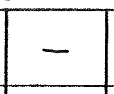

# Open Chords Charts Grammar

This file lists all the different cases which can happen in a Chords Charts.

Each case is described by an image extracted from an existing Chords Charts, and a text representation.

| Description              | Image                                         | Plain text |
| ------------------------ | --------------------------------------------- | ---------- |
| Major chord              |          | `C`        |
| Minor chord              |          | `Dm`       |
| Repeated bar (one chord) |  | `-`        |
